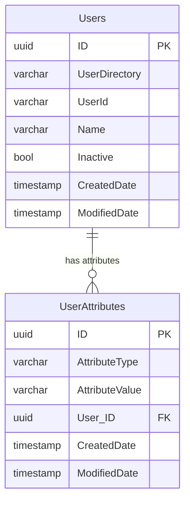

# Qlik Sense Repository Database - User Group Memberships

## Overview

`user-group-memberships.ps1` provides a readable overview of user group memberships in a Qlik Sense repository PostgreSQL database. It reports:

- summary statistics: total users, users with/without groups, distinct groups, avg/min/max groups per user
- table storage: row counts and byte sizes (exact and human-readable) of the Users and UserAttributes tables
- text-based distribution histogram showing how group memberships are spread across users
- top-N users by group count and top-N groups by user count
- optional group relevance / bloat analysis based on substring patterns
- optional full user or group listings
- filtered detail views for a specific user or group

The script is read-only and does not modify the repository database, but queries may have a minor performance impact; run during maintenance windows or off-peak hours.

The group relevance/bloat analysis (`-RelevantGroups`) is computed efficiently: it loads one row per distinct group (not one row per membership) and uses a single CTE-based SQL query for user-level breakdowns, keeping both memory usage and database round-trips low regardless of the number of users or memberships.

## Requirements

- PowerShell: PowerShell Core 6.0+ (cross-platform)
- PostgreSQL client: `psql` 12+ (script uses modern catalog views and functions)
- Network: access to the PostgreSQL server from the machine running the script

## Important notes

- The script is READ-ONLY and does not modify data.
- User records are read from the `public."Users"` table.
- Group memberships are read from the `public."UserAttributes"` table where `AttributeType = 'Group'`.
- The `-FilterUser` parameter expects the `DOMAIN\userId` format (e.g. `MYCOMPANY\jdoe`), matching the `UserDirectory` and `UserId` columns in the Users table.

## Features

- Summary statistics: total users, group membership counts, averages
- Table storage info: row counts and sizes for Users and UserAttributes tables
- Distribution histogram: text-based horizontal bar chart of group-count frequency
- Top-N rankings: users with the most groups, groups with the most users
- **Group relevance / bloat analysis**: classify groups as relevant or bloat using substring patterns (`-RelevantGroups`)
- Full user list with group counts (`-ListUsers`)
- Full group list with user counts (`-ListGroups`)
- Filtered user detail with all group memberships (`-FilterUser`)
- Filtered group detail with all member users (`-FilterGroup`)
- Stepwise debug mode (`-StepDebug`) with `-StopAfter` stages to inspect intermediate outputs
- Output to console and optional file export
- Configurable via environment variables or parameters

## Usage

### Common commands

Run summary (default mode):

```powershell
.\user-group-memberships.ps1
```

Run detailed report (includes full user and group lists):

```powershell
.\user-group-memberships.ps1 -DetailLevel details
```

List all users with their group counts:

```powershell
.\user-group-memberships.ps1 -ListUsers
```

List all groups with their user counts:

```powershell
.\user-group-memberships.ps1 -ListGroups
```

Show details for a specific user:

```powershell
.\user-group-memberships.ps1 -FilterUser 'MYCOMPANY\jdoe'
```

Show details for a specific group:

```powershell
.\user-group-memberships.ps1 -FilterGroup 'Domain Users'
```

Analyse group relevance / bloat with one or more substring patterns:

```powershell
# Single pattern - groups containing "admin" (case-insensitive) are relevant, all others bloat
.\user-group-memberships.ps1 -RelevantGroups 'admin'

# Multiple patterns - groups containing "admin" OR "sense" are relevant
.\user-group-memberships.ps1 -RelevantGroups 'admin,sense'

# Also works as separate arguments
.\user-group-memberships.ps1 -RelevantGroups 'admin' -RelevantGroups 'sense'
```

Export to file:

```powershell
.\user-group-memberships.ps1 -OutputFile report.txt
```

Change the number of top-N entries:

```powershell
.\user-group-memberships.ps1 -TopN 20
```

Run StepDebug to inspect a stage and exit early:

```powershell
# Inspect connection stage and exit
.\user-group-memberships.ps1 -StepDebug -StopAfter connection

# Inspect PostgreSQL version check and exit
.\user-group-memberships.ps1 -StepDebug -StopAfter version

# Inspect summary statistics and exit
.\user-group-memberships.ps1 -StepDebug -StopAfter summary_stats
```

### Parameters

| Parameter | Type | Default | Description |
|---|---|---:|---|
| `-DetailLevel` | string | summary | `summary` shows top-N; `details` includes full user and group lists |
| `-ListUsers` | switch | - | List all users with group counts |
| `-ListGroups` | switch | - | List all groups with user counts |
| `-FilterUser` | string | - | Show detail for a specific user (`DOMAIN\userId`) |
| `-FilterGroup` | string | - | Show detail for a specific group (exact match) |
| `-RelevantGroups` | string[] | - | Substring patterns for bloat analysis (comma-separated or repeated) |
| `-TopN` | int | 10 | Number of top entries in summary mode |
| `-OutputFile` | string | - | Write report to a timestamped file |
| `-StepDebug` | switch | - | Enable stepwise debug mode |
| `-StopAfter` | string | - | Stop after stage: `connection`, `version`, `summary_stats`, `users`, `groups`, `none` |

### Environment variables

All settings can be configured via environment variables or parameters. Defaults are shown:

| Variable | Default | Purpose |
|---|---:|---|
| QSR_DB_HOST | localhost | PostgreSQL host |
| QSR_DB_PORT | 4432 | PostgreSQL port |
| QSR_DB_NAME | QSR | Repository DB name |
| QSR_DB_USER | postgres | DB user |
| QSR_DB_PASSWORD | (none) | DB password (optional; exported to PGPASSWORD for psql) |
| QSR_PSQL_BIN_PATH | psql | Path to psql binary |
| QSR_OUTPUT_DIRECTORY | . | Directory for output files |
| QSR_LOG_LEVEL | INFO | Log level: DEBUG, INFO, WARN, ERROR |

Parameters mirror these variables and can be supplied on the command line.

## `-FilterGroup` vs `-RelevantGroups`

These two parameters serve very different purposes:

| Aspect | `-FilterGroup` | `-RelevantGroups` |
|---|---|---|
| **Purpose** | Show details for **one** specific group | Classify **all** groups as relevant or bloat |
| **Match type** | **Exact** group name match | **Case-insensitive substring** match |
| **Number of values** | Single string | One or more patterns (comma-separated or repeated) |
| **Output** | Member list for the matched group | Summary report: relevant vs bloat groups, membership row counts, user breakdown, visual bar chart |
| **Mode** | Standalone mode (replaces summary) | Additive (appended to summary output) |
| **Use case** | "Who is in the Domain Users group?" | "How much bloat do AD group syncs bring into Sense? Which groups are actually useful?" |

Example — **FilterGroup** returns the members of one exact group:

```powershell
.\user-group-memberships.ps1 -FilterGroup 'Administrators'
```

Example — **RelevantGroups** classifies *every* group as relevant or bloat:

```powershell
.\user-group-memberships.ps1 -RelevantGroups 'admin,sense'
```

### How the bloat percentage is calculated

The bloat/relevant percentages and the visual bar chart are based on **membership rows** — i.e. the number of (user, group) pairs stored in the `UserAttributes` table where `AttributeType = 'Group'`.

This means the calculation reflects **how many users belong to bloat vs relevant groups**, not simply how many groups exist in each category. A group with 200 members weighs far more than a group with 2 members.

Concretely:

- Each row in `UserAttributes` where `AttributeType = 'Group'` represents one user belonging to one group.
- A group is classified as **relevant** if its name contains any of the supplied `-RelevantGroups` patterns (case-insensitive substring match). All other groups are classified as **bloat**.
- The **bloat percentage** = `bloat membership rows / total membership rows × 100`.
- The visual bar chart (`R` = relevant, `x` = bloat) uses the same membership-row ratio.

Example: if there are 60 total membership rows, 38 of which belong to groups matching the filter patterns and 22 belong to non-matching groups, the result is 63.3% relevant / 36.7% bloat.

The report also shows group-count percentages (e.g. "5 of 13 groups are relevant") and per-user breakdowns (users with relevant groups only, bloat only, both, or neither), but the primary bloat metric is always the membership-row ratio.

## Output

### Console

The console output depends on the mode:

- **Default/Summary**: Summary statistics, table storage sizes, distribution histogram, then top-N users and top-N groups. If `-RelevantGroups` is specified, a relevance/bloat analysis section is appended.
- **Details**: Summary (with table sizes, histogram, and optional relevance analysis) + full user list + full group list
- **ListUsers**: All users sorted by group count (descending)
- **ListGroups**: All groups sorted by user count (descending)
- **FilterUser**: User info + complete group membership list
- **FilterGroup**: Group info + complete member user list

### File

When `-OutputFile` is supplied, the script writes a timestamped file to `QSR_OUTPUT_DIRECTORY` (or current directory).

## Data model



Group memberships are stored as rows in `UserAttributes` where:
- `AttributeType = 'Group'`
- `AttributeValue` = the group name (e.g. `Domain Users`)
- `User_ID` = foreign key to `Users.ID`

## Exit codes

| Code | Meaning |
|---:|---|
| 0 | Success |
| 1 | Error (fatal) |
| 2 | Warning / non-fatal issues |

## Troubleshooting

Check `psql` availability and connectivity:

```powershell
psql --version
psql -h $env:QSR_DB_HOST -p $env:QSR_DB_PORT -d $env:QSR_DB_NAME -U $env:QSR_DB_USER -c "SELECT 1"
```

If parsing errors occur, run with `-StepDebug` and the appropriate `-StopAfter` stage to inspect raw psql outputs.

Ensure the used role has read access to `public."Users"` and `public."UserAttributes"`.

## Related files

- Script: `/powershell/repo-db-optimize/script/user-group-memberships.ps1`
- Shared modules: `/powershell/repo-db-optimize/script/shared/`
- Requirements: `/powershell/repo-db-optimize/prompt/user-group-memberships.md`

## License & Additional tools

MIT

More tools at https://github.com/ptarmiganlabs
